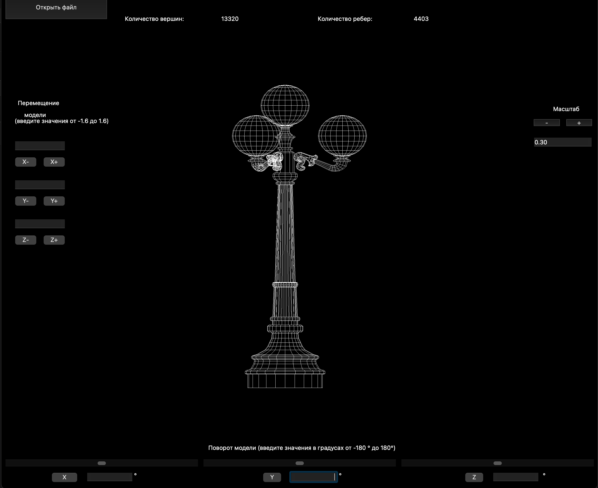

Учебный проект на основной программе в Школе 21 - реализация на языке программирования Си программы для просмотра 3D моделей в каркасном виде (формат .obj) с возможностью вращения, масштабирования и перемещения.

